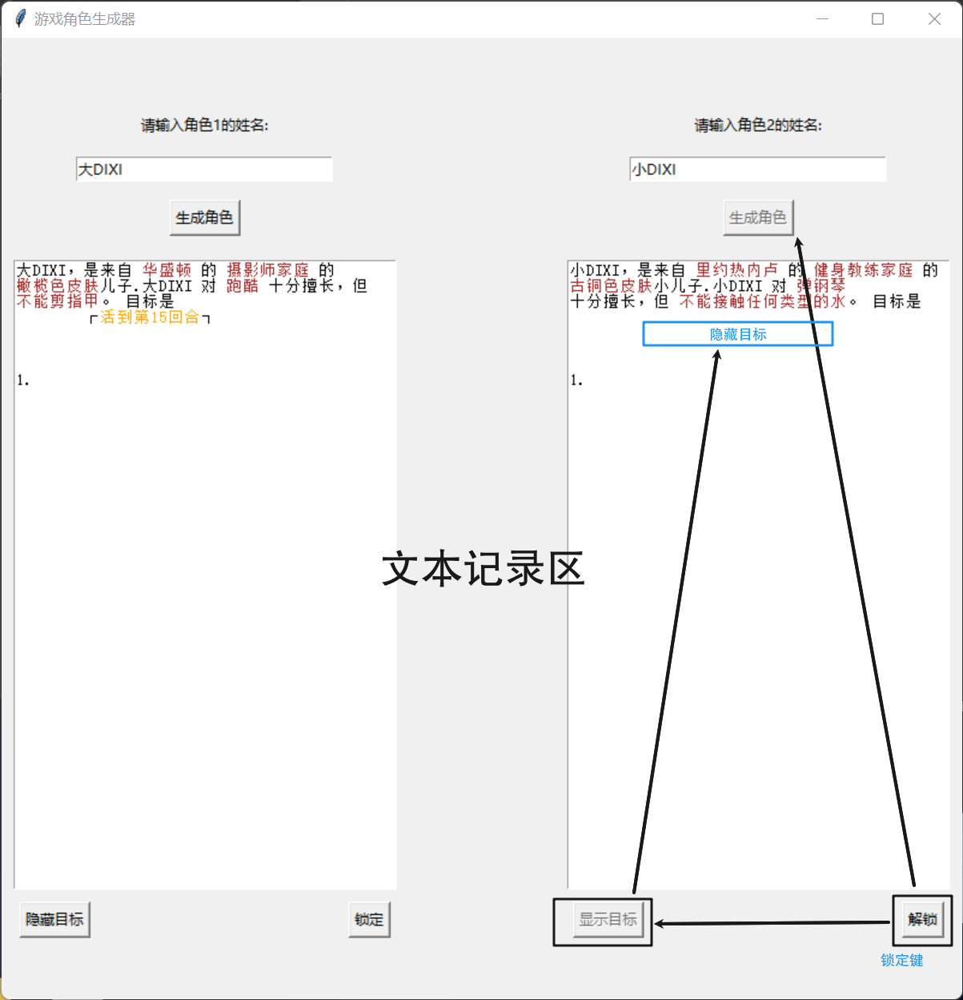

# roleMatch
随机人物角色生成（文字）

---

## 梗概

基于 python 的伪随机角色生成器，并用 `tkinter` 封装为.exe 文件


## 起因

和我弟玩基于石头剪刀布的追杀游戏，发现没有~~钱玩剧本杀~~角色支撑少点味道，于是一不做二不休，gpt了一个角色生成器😋

## HOW TO PLAY？
`dist` 文件夹下有.exe 文件，双击打开即可使用，界面如下：



## HOW TO IMPROVE？

- 目前的所有内容都在`myrole.py`文件中，可以根据自己的需求进行修改,比如修改随机库，改用.csv文件等。
---

重新封装：
``` python
# 目录下打开终端
# 输入以下命令
pip install pyinstaller -i https://mirrors.aliyun.com/pypi/simple
pyinstaller --onefile .\myrole.py
```